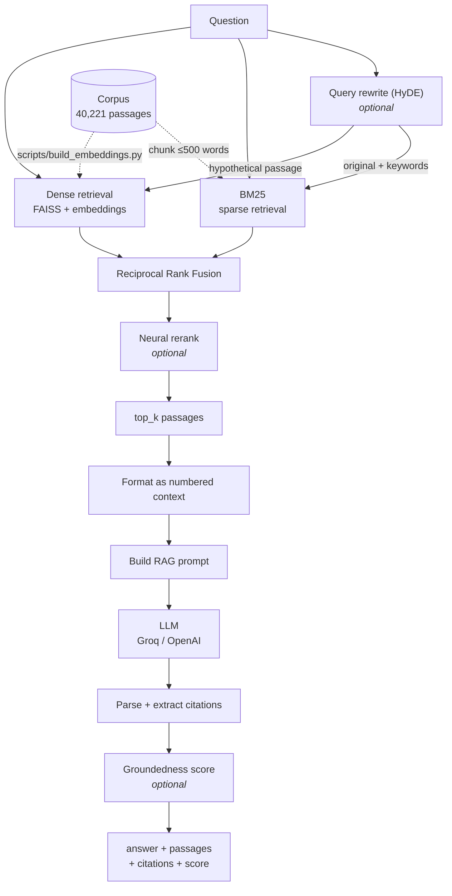

# RAG — Biology & Medical Q&A

Ask a question in plain English; get an answer grounded in a 40,221-passage biology/medical
corpus, together with the passages the answer was built from.

The system retrieves relevant passages, feeds them to an LLM as context, and returns the
answer plus its evidence. Retrieval starts as keyword search (BM25) and can be upgraded,
one config flag at a time, to hybrid dense+sparse retrieval, neural reranking, query
rewriting, inline citations, and a groundedness guardrail.

Run it three ways: **CLI**, **web UI**, or **Docker**.

- **This file** — what it is, how to run it, how to configure it, and a brief tour of every part.
- **[ARCHITECTURE.md](ARCHITECTURE.md)** — how each piece works and why it was built that way.

---

## Quickstart

```bash
./setup/setup.sh                       # copies config.toml + setup/.env, installs deps
$EDITOR setup/.env                     # set GROQ_API_KEY (https://console.groq.com)

python scripts/run_rag.py -q "What is medulloblastoma?"
```

That's it — the default mode (BM25 + LLM) needs no index build and no second API key.

**Web UI**

```bash
cd frontend && npm install && npm run build && cd ..
python scripts/run_server.py           # http://localhost:8060
```

For frontend development, `cd frontend && npm run dev` serves on port 5173 and proxies
`/query` to the backend on 8060.

**Docker**

```bash
./setup/docker-setup.sh                # or: docker compose -f setup/docker-compose.yaml up --build
```

---

## Architecture



Every stage marked *optional* is off by default and switched on in `config.toml`. With all
of them off you get a clean BM25 → LLM baseline; turning each on is an independent,
measurable upgrade.

### The request path, end to end

| # | Stage | Module | What happens |
|---|-------|--------|--------------|
| 1 | **Load & chunk** | `src/data/loaders.py`, `src/data/chunking.py` | Corpus JSON is read once at startup. Passages over 500 words are split at sentence boundaries into overlapping chunks with ids like `1234::0`. |
| 2 | **Query rewrite** *(opt-in)* | `src/query/rewrite.py` | HyDE: the LLM writes a *hypothetical answer passage* plus keyword synonyms. The hypothesis drives dense search, the keywords widen the BM25 query. |
| 3 | **Sparse retrieval** | `src/retrieval/sparse.py` | BM25Okapi over word-tokenized chunks → top `sparse_top_n`. |
| 4 | **Dense retrieval** *(hybrid only)* | `src/retrieval/dense.py` | Query is embedded and searched against a persisted FAISS index → top `dense_top_n`. |
| 5 | **Fusion** *(hybrid only)* | `src/retrieval/fusion.py` | Reciprocal Rank Fusion merges the two ranked lists by rank, not score. |
| 6 | **Rerank** *(opt-in)* | `src/retrieval/rerank.py` | A neural reranker re-orders the fused pool. Any failure degrades to fusion order rather than failing the query. |
| 7 | **Context & prompt** | `src/prompts/` | Top `top_k` passages become a `[Passage 1] … [Passage N]` block (capped at 6,000 chars) inside an "answer only from this context" prompt. |
| 8 | **Generation** | `src/generation/llm.py` | One chat completion against Groq (default) or OpenAI. |
| 9 | **Parse & cite** | `src/generation/parser.py` | Output is tidied; `[Passage N]` markers are resolved to real passage ids. Markers pointing outside the retrieved set are stripped. |
| 10 | **Groundedness** *(opt-in)* | `src/generation/groundedness.py` | An LLM judge scores 0–1 how well the answer is supported by its evidence; scores below the threshold are flagged. |

The retrieval half of this path (steps 3–6) lives in one function,
`src.pipeline.rag.retrieve_candidates()`, which is shared by the live pipeline **and** the
evaluation harness — so the numbers you measure are the numbers you ship.

---

## Configuration

Two files, both created by `setup/setup.sh`:

### `config.toml` (project root) — behavior

```toml
[retrieval]
mode = "bm25"          # "bm25" | "hybrid"
top_k = 5              # passages sent to the LLM
sparse_top_n = 20      # BM25 candidates before fusion
dense_top_n = 20       # dense candidates before fusion
fusion_k = 60          # RRF damping constant
rerank = false         # neural reranking of the candidate pool
rerank_top_n = 5       # candidates kept after reranking

[llm]
model = "openai/gpt-oss-120b"
max_tokens = 512
temperature = 0.2

[rewrite]
enabled = false        # HyDE hypothesis + keyword expansion

[citation]
enforce = false        # ask the model for [Passage N] markers and validate them

[guardrail]
groundedness_enabled = false
groundedness_threshold = 0.5
```

### `setup/.env` — credentials

| Variable | Required when | Purpose |
|----------|---------------|---------|
| `GROQ_API_KEY` | always | LLM generation, rewriting and judging ([console.groq.com](https://console.groq.com)) |
| `GROQ_MODEL` | optional | Overrides the model id without editing `config.toml` |
| `OPENROUTER_API_KEY` | `mode = "hybrid"` or `rerank = true` | Dense embeddings and neural reranking ([openrouter.ai](https://openrouter.ai)) |
| `OPENAI_API_KEY` / `OPENAI_BASE_URL` | instead of Groq | Use OpenAI or any OpenAI-compatible endpoint |

A `.env` at the project root takes precedence over `setup/.env`, and a variable already
exported in your shell beats both.

### Enabling hybrid retrieval

Dense retrieval needs an embedding index built once, ahead of time:

```bash
python scripts/build_embeddings.py     # writes artifacts/dense_index/
```

Then set `mode = "hybrid"` (and optionally `rerank = true`) in `config.toml`. The script is
idempotent — it hashes the corpus file and skips work when nothing changed. Embedding all
40k passages is a long, rate-limited run against a free-tier API; budget hours, not minutes.

---

## HTTP API

`scripts/run_server.py` serves the React build and one endpoint on port 8060.

| Route | Method | Description |
|-------|--------|-------------|
| `/` | GET | React UI (404s with a build hint if `frontend/dist` is missing) |
| `/query` | POST | The RAG pipeline |

```jsonc
// POST /query
{ "question": "What is medulloblastoma?" }

// 200 OK
{
  "question": "...",
  "answer": "...",
  "passages":  [ { "passage_id": 123, "passage": "...", "score": 12.34 } ],
  "citations": [ { "marker": "[Passage 1]", "passage_id": 123, "text": "...", "score": 12.34 } ],
  "groundedness_score": 0.87,
  "groundedness_flagged": false
}
```

`citations` is empty unless `[citation] enforce = true`, and `groundedness_score` is `null`
unless `[guardrail] groundedness_enabled = true`.

Provider failures are translated into actionable statuses rather than a blanket 500:
**400** empty question · **413** prompt too large for the model (lower `top_k`) ·
**429** provider rate limit · **502** other provider error · **503** missing API key ·
**504** provider unreachable.

---

## Command-line tools

| Script | Purpose |
|--------|---------|
| `scripts/run_rag.py` | Ask one question. `-q "..."`, `--top-k N`, `--out result.json`. |
| `scripts/run_server.py` | FastAPI server + UI on port 8060. Builds indices once at startup. |
| `scripts/search_index.py` | BM25 retrieval only, no LLM — the fastest way to debug retrieval. |
| `scripts/build_embeddings.py` | Build and persist the dense FAISS index into `artifacts/dense_index/`. |
| `scripts/evaluate_retrieval.py` | Recall/MRR/nDCG@k for bm25 vs hybrid vs hybrid+rerank against gold passage ids. `--limit N` to cap cost. |
| `scripts/evaluate_answers.py` | LLM-as-judge faithfulness scoring of generated answers against gold answers. |

---

## Evaluation

`scripts/evaluate_retrieval.py` scores retrieval against the 707 gold question/passage pairs
in the test split, using the same `retrieve_candidates()` the live pipeline uses. Chunk ids
are mapped back to parent passage ids before scoring, so chunking never inflates the numbers.

Current BM25 baseline at k=5 (`artifacts/eval/retrieval_results.json`):

| Metric | Score | Reading |
|--------|-------|---------|
| Recall@5 | 0.503 | Fraction of gold passages retrieved. Questions average ~8.7 gold passages, so recall@5 is mathematically capped well below 1.0 — the harness reports that ceiling as `max_recall_at_k`. |
| MRR@5 | 0.831 | A relevant passage is usually rank 1. |
| nDCG@5 | 0.737 | Relevant passages sit near the top of the list. |

Hybrid and hybrid+rerank rows appear automatically once `artifacts/dense_index/` exists.

---

## Project layout

```
config.toml              Behavior config (copied from setup/config.toml)
setup/                   setup.sh, .env(.example), requirements, Dockerfile, compose
data/json/               Corpus and question-answer-passages splits (json/csv/parquet)
artifacts/               Git-ignored generated state: dense_index/, eval/
src/
  config/env.py          .env loading, precedence-safe and idempotent
  data/                  loaders.py (corpus + QA), chunking.py, lookup.py
  retrieval/             sparse.py (BM25), dense.py (FAISS), fusion.py (RRF), rerank.py
  query/rewrite.py       HyDE hypothesis + keyword expansion
  prompts/               templates.py (system/user/citation), formatter.py (context block)
  generation/            llm.py (provider client), parser.py (cleanup + citations),
                         groundedness.py (LLM judge)
  eval/metrics.py        recall@k, mrr@k, ndcg@k, max_recall@k
  pipeline/rag.py        Orchestration — retrieve_candidates(), rag_query_full()
scripts/                 CLI entry points (see table above)
frontend/                React 18 + Vite 5 UI
tests/                   147 pytest tests
```

**`artifacts/`** is git-ignored but load-bearing at runtime: it holds the FAISS index
(`dense_index/index.faiss`), the corpus id order and hash used to detect staleness, and eval
output. Docker mounts it as a volume so it survives rebuilds.

---

## Tests

```bash
pip install -r setup/requirements-dev.txt
.venv/bin/pytest       # 147 collected: 140 pass, 7 skipped
```

The 7 skips are `scripts/evaluate_answers.py` integration tests that need a live provider.

Tests cover chunking edge cases, RRF fusion, rerank response parsing and fallbacks, citation
extraction and validation, groundedness score parsing, retrieval metrics, config merging,
pipeline integration, and server startup. Network calls are mocked — no API key needed.

---

## Known gaps

- The React UI shows the answer and retrieved passages but does not yet surface `citations`
  or `groundedness_score`, even though `/query` returns both.
- Building the dense index is bounded by OpenRouter free-tier rate limits; the embedding
  path throttles and retries, but a full corpus build takes hours.

---

## Tech stack

**Backend** Python 3.11 · FastAPI · uvicorn · pydantic · rank_bm25 · faiss-cpu · numpy ·
httpx · openai · python-dotenv
**Frontend** React 18 · Vite 5 (no UI framework)
**Providers** Groq (LLM, default) · OpenAI-compatible endpoints · OpenRouter (embeddings, reranking)
